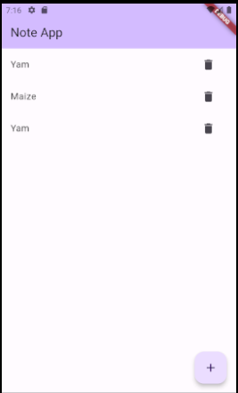
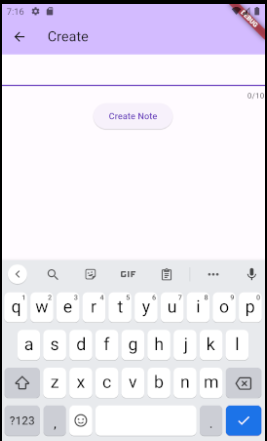
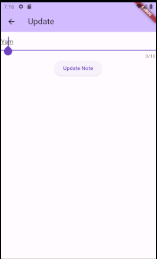

# flutter_note_app

This Flutter app is designed to work seamlessly with the Django Note API, providing a convenient way to manage your notes on the go.

## Features

- View all notes
- View a single note
- Create a new note
- Update an existing note
- Delete a note

## Getting Started

### Prerequisites

- Flutter installed on your machine
- Emulator or physical device for testing

### Installation

```bash
# Clone the repository
git clone https://github.com/a-bew/flutter_note_app.git

# Navigate to the project directory
cd flutter_note_app

# Install dependencies
flutter pub get
```

### Usage
- Open the project in your preferred Flutter development environment.
- Ensure your Django Note API is running.
- Update the API endpoint in the app to match your Django Note API server.
- Run the app on an emulator or physical device.

### Screenshots
- Notes Screen
    
- Add New Note
    
- Update Existing Note
    

### Contributing

If you'd like to contribute to this project, feel free to fork the repository and submit a pull request.

### License
This project is licensed under the MIT License.

### Acknowledgments
Special thanks to the creators of the Django Note API for providing a robust backend.